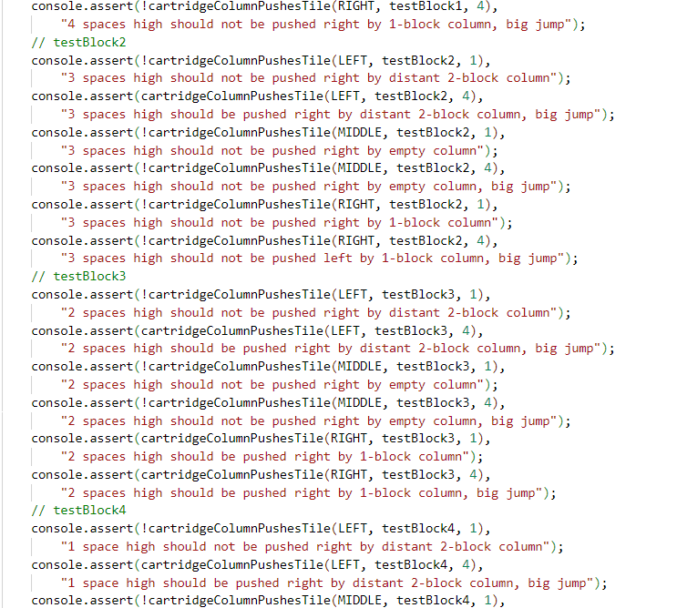
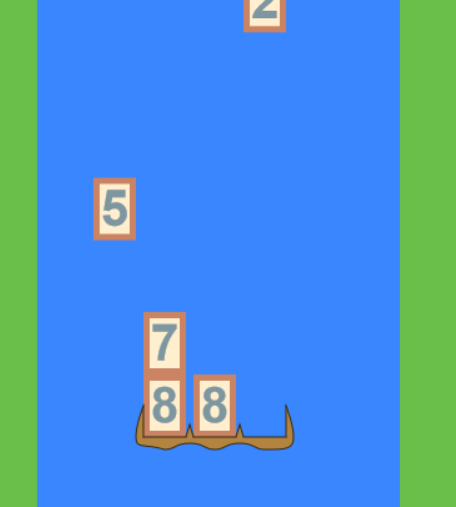
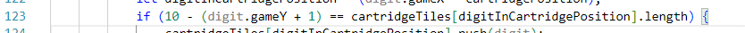
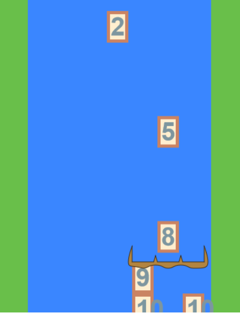
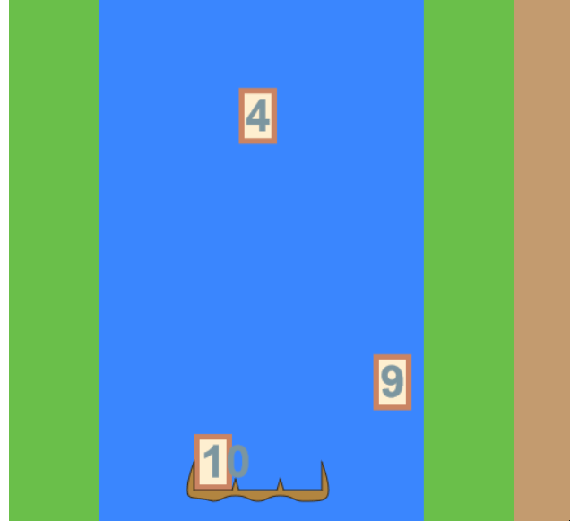

# Day 10: Testing Suite, Part 2

## State of the Game

Most of the immediate issues with block pushing have been resolved, but the code isn't quite working fully.

## Today's Goal

Fill out the test suite and use the tests to help refactor the block pushing code.

## Background

We're getting far enough along that we're close to start adding in some factoring functionality. But factoring will also benefit from testing suites, given that there will be several different numbers to factor, and several different components to get functioning in our factoring pipeline.

Our function, `cartridgeColumnPushesTile` needs to be modular and independent of other variables. Note that, in its current state, we have to pass in both the left and right boundaries of the movement space, when these could both be determined from the cartridge's movement, the (public knowledge) position of the cartridge, and the (already given) column in question.

For now, we focus on building the test suite. [As I said last time](9.md), there are at least 5 * 3 * 2 * 2 = 60 test cases to build, though it doesn't hurt to overtest than to undertest, so long as there is some consistency. Our tests will focus on different things: blocks being under the cartridge; blocks being pushed left.

We also need to test whether the cartridge can't move left or right because of the game boundary. Should this be handled within the `cartridgeColumnPushesTile` function, or in the `moveCartridgeTo` function? We know that in the relevant cases, the cartridge SHOULD push the tile, but can't because the boundary "pushes" back. If the cartridge DIDN'T push the tile, it could freely move towards the boundary. So we want to ensure that the `cartridgeColumnPushesTile` would push them offscreen, but `moveCartridgeTo` prevents it from doing so.

Note that every time we call `moveCartridgeTo`, we have to reset the values of the `cartridgePosition` and `cartridgeDirection`, and the tile's gameX.

## Actions

Before I go building the test suite, I should resolve the function definition above to avoid rewriting them.

`moveCartridgeTo` passes in `xPos` as a parameter. The key insight is that `cartridgePosition + movement == xPos`, so `movement = xPos - cartridgePosition`. This parameter gets passed into `cartridgeColumnPushesTile` where the `offsetPosition` is calculated, and then the `leftPosition` and `rightPosition` are calculated from that.

Now for the tests. It largely consists of writing lots of tests for the left...

...

... and lots of tests for the right...

...

...

So, the fact that this ended up taking a few days just to create is clearly a sign that testing is one of my weaknesses. But I do eventually do it. And I discover that my `cartridgeColumnPushesTile` does not work as intended with my "subtract 2" workaround that I established the other day. I have to REMOVE that to get the tests to work... but now the tile-pushing doesn't work in-game!

There's one modification that I decide to throw in, in order to make it easier to see what is happening to the game tiles. And that is the change the value of the digits to match its current `gameY`. And I discover something interesting...

Somewhere in my code, I established that the cartridge exists at the bottom of the 9th row, instead of the bottom of the 12th row as I believed from my `TOTAL_POSITIONS_HIGH` constant. I remember earlier I had issues with the cartridge being drawn much lower than I had wanted. This explains a few things about the inconsistency between my model and the display. The tiles WERE being pushed appropriately; it's just that the cartridge isn't being drawn in the proper area!

And here is one of the culprits:

I was still using the hard-coded "10" instead of the TOTAL_POSITIONS_HIGH. Let's fix that:

Now our tiles are landing where they're SUPPOSED to. Without knowing what rows they were supposed to be landing at, I have been making changes to my code that didn't reflect the model. To solve THOSE issues, I need to go back to the `constants` file and fix the `TOP_MARGIN_HEIGHT` definition, then change the `baseY` value in `drawCartridge` function to change an unexplained "3" to a "1".

## State of the Game, and Future Plans

So of course I'll change back the digits to their proper forms, but this was an important step. All of the pushing tests now pass, the cartridge now ignores tiles that fall below the cartridge, and there's no more issues with pushing blocks against the edge. All because of some misunderstood code. (Oh, and also because I had been improperly setting the tile's `gameX` when pushing right, in blind obedience to the pushing left code.)

It's high time I get started on the next major feature of the game: factoring. And to start off, let's set up the satchel.