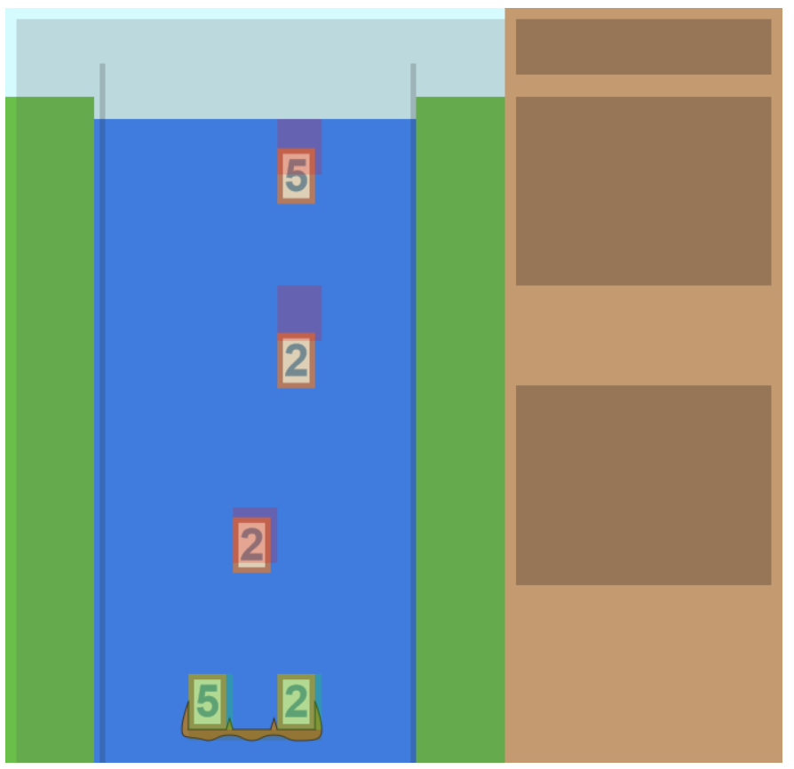
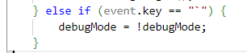
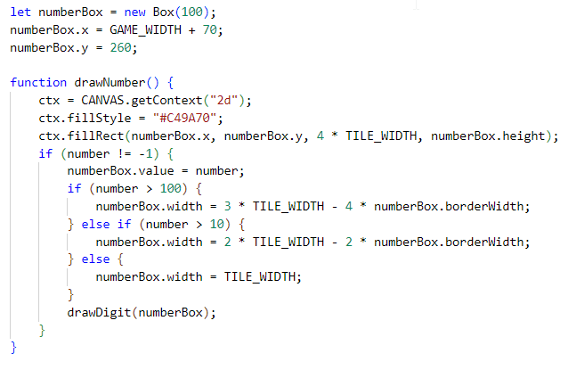
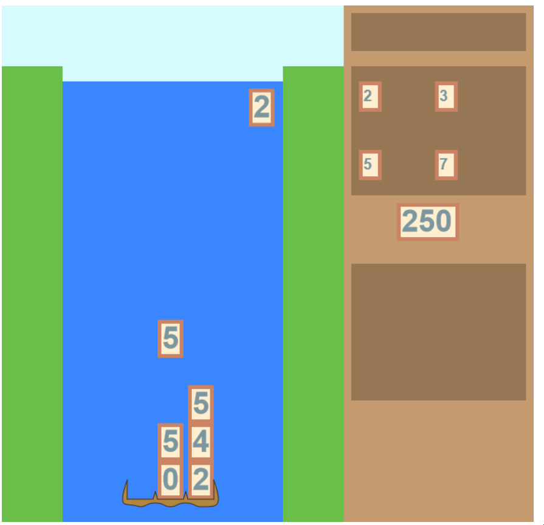

# Day 11: Factoring, Number Drawing, and Simplifying the Canvas

## State of the Game

Everything with the block collecting and pushing now works as intended.

## Today's Goal

Let's turn numbers into factors... and draw the factors on the satchel.

## Background

Okay, so let's take a big-picture view of what we intend to do with factors. As soon as a number is built, we want to get the prime factors and put those primes into our satchel. It's pretty easy to find the prime factors of a number, using trial division.

Another avenue we'll eventually need to figure out is how to quickly generate factors of a given prime, but that can wait until later. (Efficiency may or may not matter for that.)

One issue we should take is how to reveal the factors on stage. We'd ideally want to draw the number itself in our presentation layer only. But how to resolve this? Another issue I've researched is that, if I put my presentation layer on top of the game, all of the events will have to be directed through the presentation layer as well.

## Actions

I'm going to take a bold action and simplify the game's canvases into one canvas. In a team setting, this would be done on its own branch as a proof of concept, and then integrated later on... or would it? Having no experience with a team setting, I could imagine instead we'd have more discussions about how to get canvases to lay atop other layers and seek out other professional opinions... but my inclination is that, for a game of this size, and for the devices I am aiming for, the performance won't be affected by having everything drawn on one canvas. Besides, we are still separating which parts of the canvas are being drawn, rather than all being drawn on top of each other.

This requires changing our `index.html` layout, and converting all `*_CANVAS` variables to a single `CANVAS`. Because the only canvas not aligned with (0,0) was `SATCHEL_CANVAS`, which we haven't done anything with besides drawing the satchel, we only need to change one collection of x-coordinates in one function. All in all, it's very easy to make this change early on. And we do get to finally appreciate what the debug screen was meant to look like:

Let's turn it off with a simple addition to our keyboard functions:

Okay. Let's get back to the satchel. I will draw the number in the convenient center space. I'll save drawing the factors for tomorrow, and focus solely on the number.

## Issues

There's a lot more that has to be done, but it is a good start. Over the next few days, I can keep building 

## State of the Game, and Future Plans

Lots of numbers still to draw. I'll need to draw the factors for the number, how many common factors we've collected, the uncommon factors that were collected, the counters for each of those... More tomorrow.