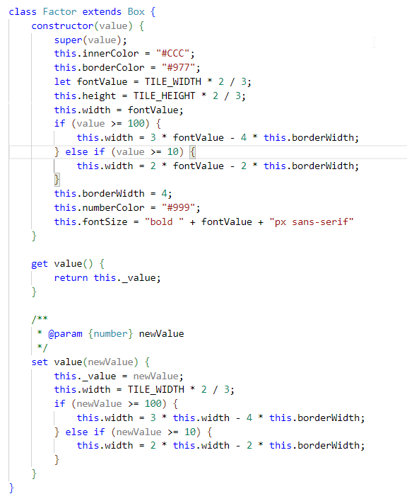
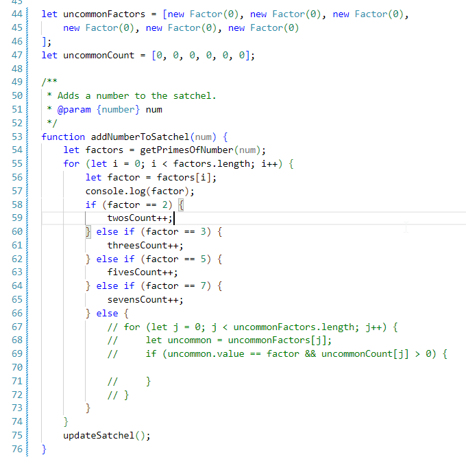
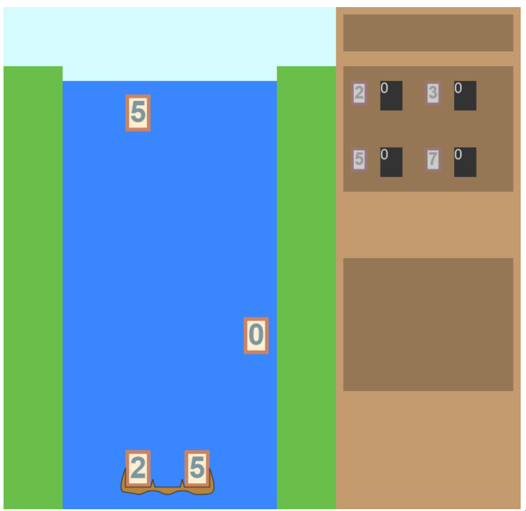

# Day 12: Counting the Factors

## State of the Game

When we gather 3-digit numbers, we see the new number in our satchel, but no factors.

## Today's Goal

Let's draw the factors into our satchel, starting with the common factors.

## Background

There's a few different directions we could go with the factors. Do we represent them merely as boxes, or as their own objects? Casting them as objects makes the most sense, since we will be animating these factors in the future. That being the case, should we create them on the fly, or keep an offstage collection to be drawn onscreen (akin to the digits)?

How many factors will be onscreen at any given point? We shouldn't count the four common factors that will always be onscreen. There will be six uncommon factors that will be modified and displayed. From simple math, we know that no 3-digit number can have more than 9 prime factors (2^9 = 512). We can limit it even further if we delay the "break-up" of the number until each factor has landed in the satchel.

We can focus on animation later. The simplest solution, for now, is to just increase the factors instantly upon collection. If we do want any animation, it should be the relevant factors briefly "popping" upon incremention. In any case, we will need our own factor class.

## Actions

I extend the `Box` class into its own `Factor` class. We _could_ define a few one-digit, two-digit, and three-digit Factors ahead of time, but that would complicate our design -- suppose a player gets 6 different 2-digit factors, clears them out, and then gets 6 3-digit factors? Much cleaner to just change the width automatically when we change the value, if we can do that within the method:

Now, as for the factors... I'll keep building on `factoring.js`, since that's where the relevant info is. Should I move it into a separate file? (Perhaps called `satchel.js`?) Well, the satchel isn't complex enough for that, yet. For now, I'll create a new function called "addNumberToSatchel". It will retrieve the factors and process them iteratively.

The common factors are simple: no adding elements, just increase the counts. Let's just ignore the uncommon factors so I can focus on drawing the counts:

After adding the `factoring.js` to the main HTML file, I now replace the `drawSatchel` method call after eliminating the bottom row with `addNumberToSatchel`, and now the number counts should update... right?

## Issues

I tried replacing Boxes with Factors everywhere, and it caused a bit of an issue with the number box... the solution was to turn that back into a regular box. There's still an issue with resizing this box now...

There's a related issue. The boxes that hold the common factor counts are clearly not big enough to hold the numbers. I need to change the font size, so I'll switch to something smaller and more distinct.

## State of the Game, and Future Plans

Well, the factors are showing up... but it lacks in interactivity, and oomph. Unless you're watching the numbers closely (which you won't do while trying to catch the falling digits), you won't notice which numbers you've just factored. Simply "popping" the numbers that change won't help either; there's too many to keep track of. Better to just have a list of factors immediately after the new number built, so we can glance at it in between digit catching.

There's also issues with the number appearance, but we'll have to adjust that anyway. The other major issue is that I still haven't implemented the uncommon factors. That will have to wait until tomorrow.