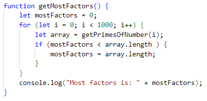

# Day 14: Uncommon Primes

## State of the Game

A couple of changes were made since the last time in order to fix two bugs: one with moving the cartridge, and one involving the captured number box displaying onscreen. 

## Today's Goal

Show all of the factors of the number, and add the uncommon factors.

## Background

As I recall, I want a system that creates the prime factors ahead of time. Similar to the falling tiles, I want an array that will store these boxes, utterly interchangeable, and move them on and off the stage as needed.

A quick test function confirms that there will be at most 9 factors (all 2's). We can get away with displaying them to the right of the number, one after another or until we hit the edge of the screen. We'll put this in its own function in the `satchelGraphics.js` file.

## Actions

## Issues

## State of the Game, and Future Plans
