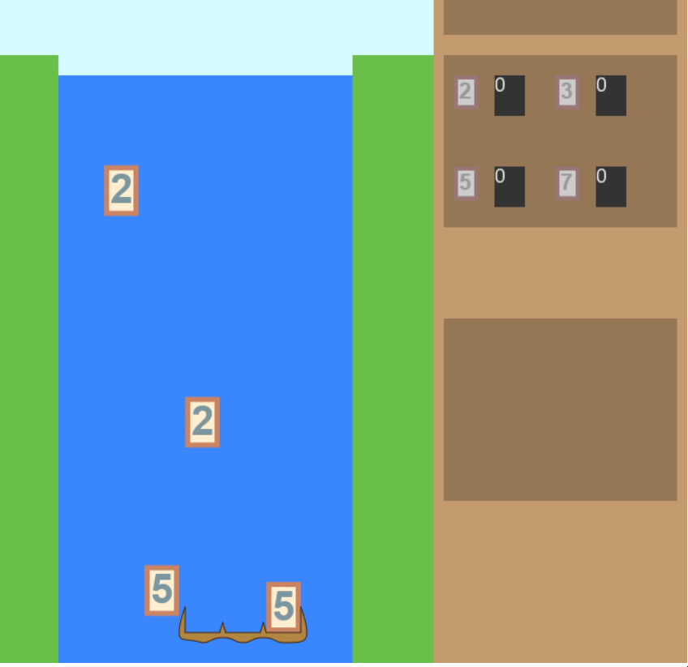

# Day 16: Factor Display, Continued

## State of the Game

The game is in much the same state as it was on day 15.

## Today's Goal

Create the list of factors for every newly captured number. Optionally, add the uncommon factors in the box below.

## Background

The effect we want will be done by an array of Factors that we update every time a number is captured. Updating these Factors will consist of:

* changing the value of each Factor;
* setting the visibility of the Factors;
* setting the X and Y position of each visible Factor.

There are three ways we could set a Factor's visibility. The first is to keep two separate arrays of Factors, one for visible Factors and one for invisible, then pop the Factors from one array and push to the other, and then only render the visible Factors. The second is to maintain a boolean variable within the Factor class, keep just one array of Factors, and then only render a Factor if its visibility is "true". The third also uses one array of Factors in our graphics class, but also keeps an integer variable that represents the number of visible Factors. Then, only the first `numVisibleFactors` Factors are rendered. This also has the advantage of not needing to swap in and out objects from arrays, an expensive operation that is prone to mismatches between Factor indices and graphic position.

Our code currently uses the first technique, but let's switch to the third. There's only a maximum of 9 Factors we can make. To keep it both visually interesting visually compact, and easy to code, we'll stagger the Factors in a "W"-shaped zigzag, where the first and smallest Factor is displayed in the upper-left, the second-smallest just to the lower-right, the third to the upper-right, and so forth. Each Factor is rendered from smallest to largest on top of each other. We shouldn't have to adjust the X-positions for each Factor, but we will consider it.

## Actions

Our target is the `drawFactors` function in the `satchelGraphics.js`. We need to rewrite this code to follow the third technique as described above, and then plug in the `drawFactors` function where it would make the most sense.

`drawNumberAdded` makes the most sense, except it is currently being used to both ''clear the number area'' and ''draw the added number''. Let's split these functions up, and create a new file called `satchelHandler.js` that will take inputs from the `waterfallModel`, handle the factoring, and send the outputs to the `satchelGraphics`.

## Issues

After tinkering with the numbers to get them aligned, I notice a problem with the factors. There's too much extra space for long factors. I moved around the variables (and create a new function so that it doesn't have to be redefined in both constructor and setter) and played around for a bit until I got a natural-looking result.

## State of the Game, and Future Plans

Displaying the factors does a lot to connect the number we've built with the factors we've gathered. But there's plenty of room for improvement in terms of visual feedback. For now, we should focus on the last important bit of gameplay: the uncommon factors.