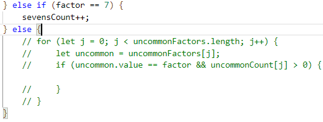
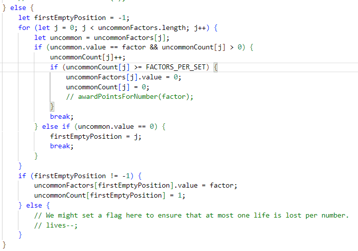
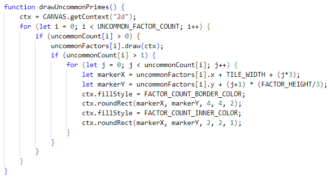
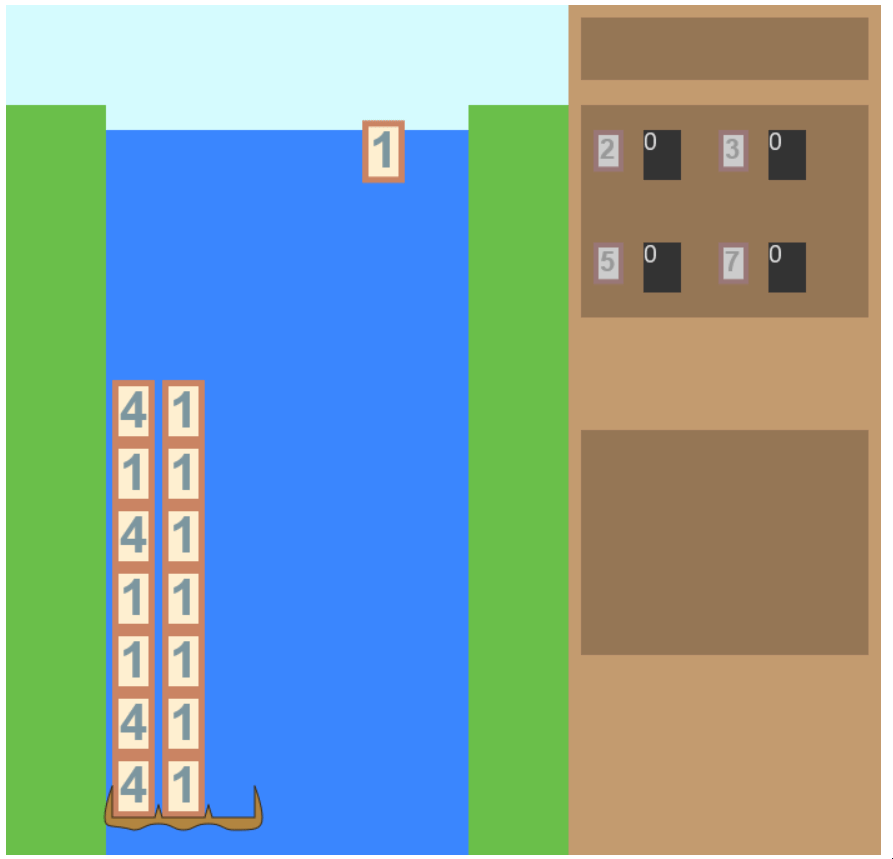

# Day 17: Uncommon Primes, Continued

## State of the Game

The factors now display when 

## Today's Goal

Add the uncommon factors in the box below the other numbers.

## Background

By now, adding numbers to the display is easy. What we need is a system that does the following:

* Iterate through every uncommon factor, including duplicates. Is this number already in the satchel?
** If yes, increase its presence by 1. Has it hit the maximum amount of presence (in this case, 3)?
*** If yes, remove it and award points.
** If no, are there any empty places available?
*** If yes, add it and set its presence to 1.
*** If no, lose a life. (We might set a flag here to ensure that at most one life is lost per number.)

Here's a more practical decision to make: when a factor is removed from the middle of the satchel, what should happen to the factors after it? Should they move further up the satchel or remain in place? This depends on whether we value consistency over time, or consistency in placement. Since I plan to implement the ability to select factors to highlight potential multiples, it will be easier if these numbers are kept in place. This also means that numbers won't necessarily be in numeric order over time, but the limited range of values should make it easy to find any particular value over time.

## Actions

There was some temporary code in the satchel handler written long ago that outlines the basic approach:

Let's expand it and connect it to our existing game variables:

Now we just need to draw the uncommon factors when we draw the satchel. While I'm at it, I'll convert some of the satchel values into constants:

## Issues

Since testing the uncommon prime counter requires getting the same uncommon primes in a row, I'll write some dummy code to change the group of numbers that get selected to only 2 digits, 4 and 1. 

After some testing, there are two major problems that arise: first, although the factors are being added, duplicates aren't showing an increasing count. Second, when enough factors have been collected, they don't disappear as they should. Perhaps this is because the uncommon factors section isn't being redrawn?

There is another unintended logic mistake. Breaking the loop when an empty space is found, means that an existing uncommon factor may go completely unnoticed. Whoops. Better remove that and only use the empty spot if a factor wasn't found.

## State of the Game, and Future Plans

Though the uncommon factors are displaying, there's still a bit of overhaul needed. We need to get the counter working, and we need to establish the scoring system, and we need to show a life counter and a game over screen. A welcome screen and intro screen would be welcome too (no pun intended).

We're getting closer to a playable game, but there are plenty of quality of life improvements left to add (and we also need to figure out that one bug above where an uncommon factor seems to shift places in the satchel!).