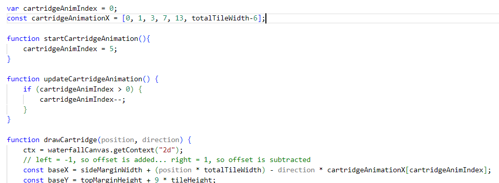
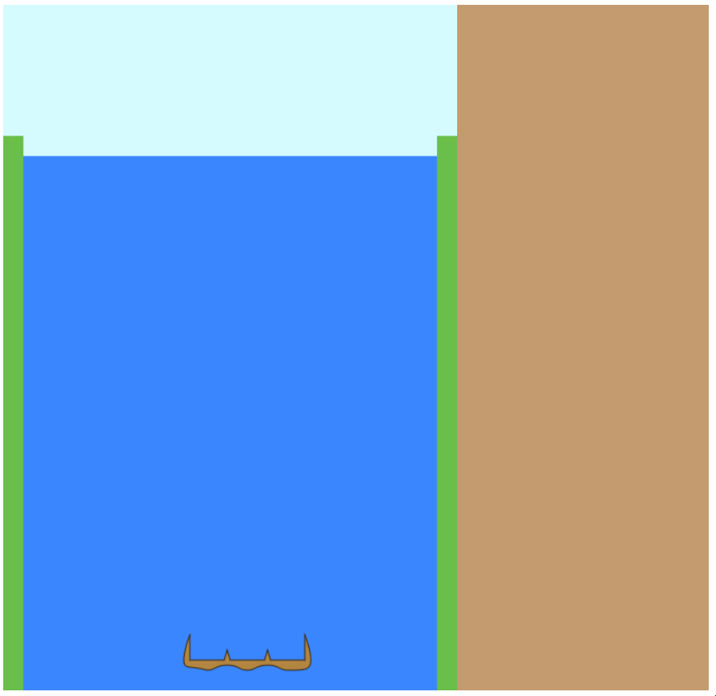

# Day 2: Moving the Cartridge

## State of the Game

We have a graphic display of the game, but no interaction.

## Today's Goal

Add some mouse events to move the cartridge around .. and some keyboard events if we can.

## Background

I cleaned up yesterday's log a bit... it just isn't readable without pictures to illustrate the development. Hopefully it will serve the purpose of illustrating my design choices, without needing to be a tutorial.

Since I want the game to be runnable on a screen with no keyboard input, it's important to use mouse events here. Our main form of control is to move the cartridge left or right. We'll add this event to the waterfall canvas, and leave the satchel canvas to its own events. This will be a very simple form of control.

Thinking about where to add this function, I decide that it's best that I use a controller class to hold this event, and any other events for the future. Data will flow outward from this class to the game class, never inwards.

## Actions

I create a new controller class and add a mouse handler to the waterfall canvas. If the user selects the left side, the cartridge will try to move left; otherwise, it will try to move right. I purposefully leave a thin central part of the canvas to do nothing, to minimize confusing inputs.

If the waterfall is 10 blocks wide, and the cartridge is 3 blocks wide, then of course there are only 8 possible positions for the cartridge, from 0 to 10 - 1 - 2. We have to redraw the waterfall along with the cartridge, but we would have to do that anyway when our cartridge is carrying dozens of blocks.

I move around some of the code so that the canvas elements, defined in graphics, will be available in the controller. Since the graphics file controls the logic closest to the HTML document, it makes sense to put it first.

This lets me do a bit of housekeeping from last time. Rather than pass the context into the function, I call the context from the global canvas within the function. I also take care of an issue with the gap between canvases, caused by the newline between them in the HTML.

Since this took so little time, I'm going to move ahead to the next task, which was...

## New Goal

... to give the cartridge a bit of animation as it moves from side to side.

## Background

Canvas events, and HTML in general, doesn't have the same concept of running every frame like ActionScript or Unity does. Instead of a fixed frame rate, it requests a frame of animation and waits for those resources to be made available. This is why, when the browser is heavily taxed, the animation appears to slow down without dropping any frames. We use the same principle while animating the cartridge.

How responsive should the cartridge be? We may need to capture blocks in split-second time. Let's give the cartridge 5 frames of animation to move; an initial jolt, then a slowdown of 4 frames. This will work whether the cartridge is moving left or right.

Remember, at no point are we storing the physical coordinates of a cartridge object. The model dictates where the cartridge actually is; the graphics is merely the visual display. The physical location is stored via a combination of an animation index and its model location. To animate the cartridge, we update the cartridge's animation index every frame and draw it as appropriate. For the purpose of this stage, we will update the cartridge's position at the very beginning of movement, even if it hasn't moved into the column yet. We will also allow multiple movements, resetting the animation everytime.

## Actions

This took quite a bit of finagling to get to work. I added an artificial dampener to the update function in order to test out the speed. I ended up using two variables, one to hold the new cartridge position and one to store the direction of movement. Trying to determine the direction from the old position and a "target position", and trying to update the new position once the cartridge was far enough in its animation, only made things confusing.

## Issues

How will the animation look if the tile width is significantly widened or shortened (particularly if the tile width is 20 or less)?

## State of the Game, and Future Plans

The cartridge has been animated and now responds to user input. Next I will add the second major component of the game: the falling blocks.

