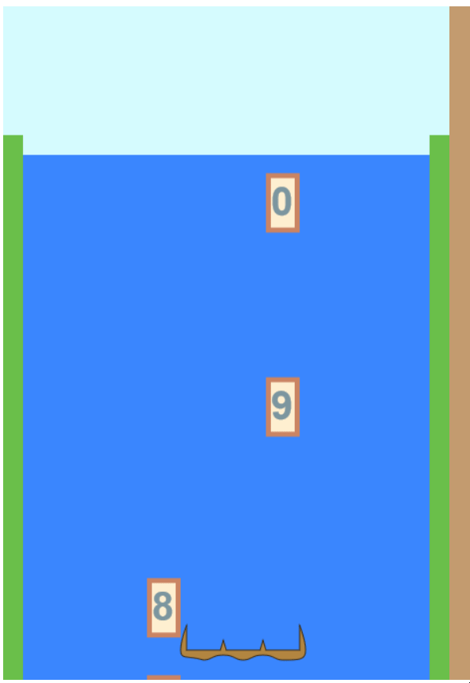

# Day 3: Adding Digits

## State of the Game

The game has a moveable cartridge, but nothing to catch.

## Today's Goal

To create some boxes that will hold digits for our cartridge to catch.

## Background

First let's step back and think. We're going to be rendering multiple types of boxes throughout the game. Digits will be doing one of three things: emerging from above the waterfall, falling from the top of the waterfall, or moving with the cartridge. Factors will either be sitting in the satchel, or be animated on the presentation layer. Numbers, in the general case, will only appear in the presentation layer after a 3-digit number is created. All three of these cases will have different properties and behave differently, but they will also share certain appearances and properties.

This seems like a perfect case for creating a Box class and different subclasses. Where should we define it? Although it will be drawn graphically, the digits are a fundamental part of the game model. Let's give them their own file. The graphics file will handle the graphical display, and the game file will handle the manipulation of them. We will need a method for the Digit class specifically about updating their position every frame.

Speaking of... how should we instantiate them? There are two approaches. Because the number of digits is constrained by the size of the game board, we could just instantiate the maximum number of them at the beginning and store them off-canvas until in-game. Or we could instantiate as needed and let the garbage collector handle them. I decide to instantiate them at once, with four arrays to hold them for each of the four states the tiles could be in:

1. Offscreen, and not displayed.
2. On the river above, slowly emerging, drawn behind the waterfall.
3. Down the waterfall, mapped to the model grid, subject to gravity, destined to either land on the cartridge or reach the bottom.
4. In the cartridge, waiting for other digits in the same row in order to be teleported offscreen.

The full logic will take a while to implement. Let's focus only on states 1 and 3 for now.

## Actions

We create a Box class, then extend it a Digit class. In the graphics file, I add a new function for drawing boxes. (While I'm at it, let's rename our global variables to match the standard style, ALL_CAPS_SNAKE_CASE, and move them to their own file, a "constants" file.)

I realize that, though it is useful to assign an "x" and "y" to a Box object, for a Digit object these are derived values from its game location, plus its animation. So I create a getter for the "x" and "y" there, with special conditions for when the tile is on the river or on the waterfall.

Now that the graphics are added, I modify the game file. First I create the four arrays. Then I initialize the offscreenTiles array. I add a new timer condition to the update function, so that every second, a new tile gets added to the waterfall. To keep the screen from getting overpopulated, I decide to update the animationY value as well, and modify the gameY value along with it. This will be modified in the future for collision testing with other game objects.

## Issues

The first issue is setting a "getter-only" property, x, in the Digit class. Trying to fix this by adding getters and setters to the Box class leads to more errors. I have a realization: I will need to make x and y private variables, and keep the normal getters and setters in the Box class, but override them with derived getter-only values in the Digit class. I do write some setter code for the x and y, constraining them to the game grid, but I comment it out.

The boxes now appear and descend, but their border and inner colors are not being updated. Oops... I didn't format the strings correctly.

I have a few things to figure out... when they descend off the bottom of the screen, I need to remove them from the waterfall array and back into the offscreen array. Also, when the browser is not in focus, there is some interruption in the drop of blocks. The whole game should pause when this happens, so that there's no bunching up of tiles.

## State of the Game, and Future Plans

I have a moving cartridge and falling tiles. The next step: get them to interact!

