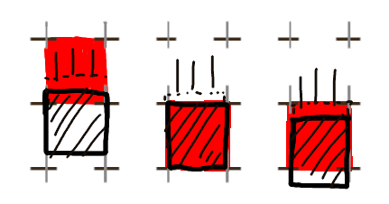
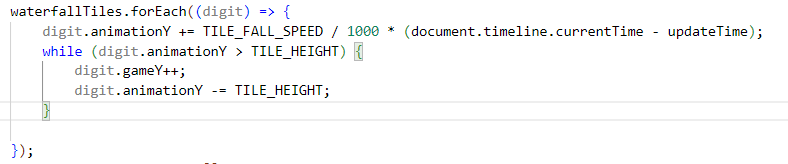
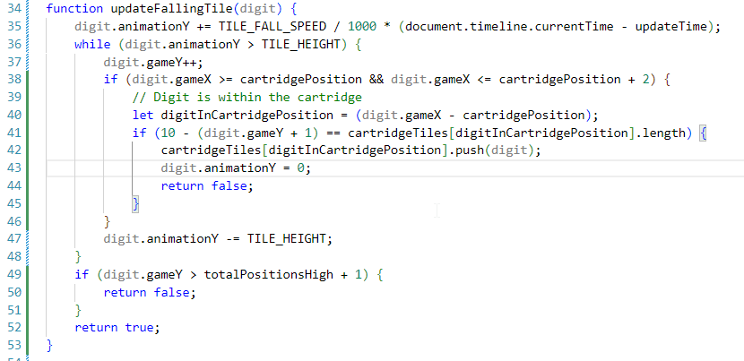
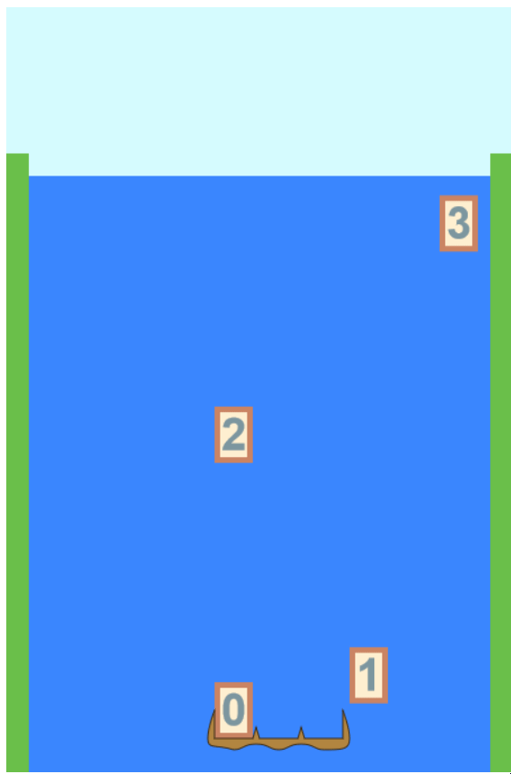

# Day 4: Blocks in the Cartridge

## State of the Game

We have a moving cartridge and falling number blocks, but they do not interact in any way.

## Today's Goal

Get blocks to land on the cartridge.

## Background

Collisions are one of the most notoriously difficult parts to model in a physics engine. Our game has a drastically simplified physics model, and in fact the only times a block has to interact in the vertical dimension is between a falling block and the cartridge space -- either the cartridge itself, or a block on the cartridge. We also don't have to worry about multiple blocks falling at once or overlapping -- framerate bugs aside.

I've designed the block model so that, even though each block animates smoothly, the game model only sees it as belonging to the upper square, only updating once it advances one full square down:

The upshot of this is that, while the falling digit is updating its position, it also checks to see if the cartridge or a box is directly below it. If so, its motion becomes tied to the cartridge's. Not only will it move along the cartridge, but it will also be the new basis for higher-up blocks to check for a collision.

## Actions

We want to update the game file, specifically the lines where the tile updates its Y position:

I've moved it to a separate function that checks if its X position is within the cartridge's range, and then if the space below it is the topmost tile in the cartridge. Note that this check only happens when the tile's Y position changes:

I'm also removing some redundancy: the waterfall tile array gets updated every frame, specifically to check if a tile has gone offscreen. Since we also need to remove waterfall tiles if it gets added to the cartridge array, we combine them into a single boolean result (with the much simpler check for an offscreen collision getting checked again in the main loop).

The only thing to change now is to draw the boxes that appear in the cartridge code. I add a third parameter containing the cartridge tile array, and draw those boxes in first in the graphics file.

I also need to update the positions of every tile in the cartridge every time the cartridge moves. The code for this is not straightforward: I have to update each tile's "animation X" at the same time as I draw the cartridge, unlike with regular waterfall tiles. (Perhaps "animation X" should be renamed to "offset X"?)

## Issues

After all this, the tiles do land on top of each other. The problem is, they are quite literally "on top" of each other. Perhaps if I change the Y coordinate when it "lands"... Ah, it turned out that I wasn't using the correct tile height. I'll change the tile width and tile height to the constants.

On the plus side, this does now allow me to check that the 10 tiles I initialized are indeed being moved back to the top of the waterfall.

A couple more errors I notice: the satchel isn't being drawn to the right, and there's an error in the inspector about ``tileArray`` not being defined. There's one reason to both: the initialization line for the cartridge is still using one parameter. I add two new empty parameters to fit the new definition.

## State of the Game, and Future Plans

As you can see, the cartridge now collects tiles, but it doesn't do anything with those tiles, nor does it prevent movement of the cartridge with a falling tile.

I have two choices now for next time: remove completed rows from the cartridge, or refine the side-to-side cartridge movement.