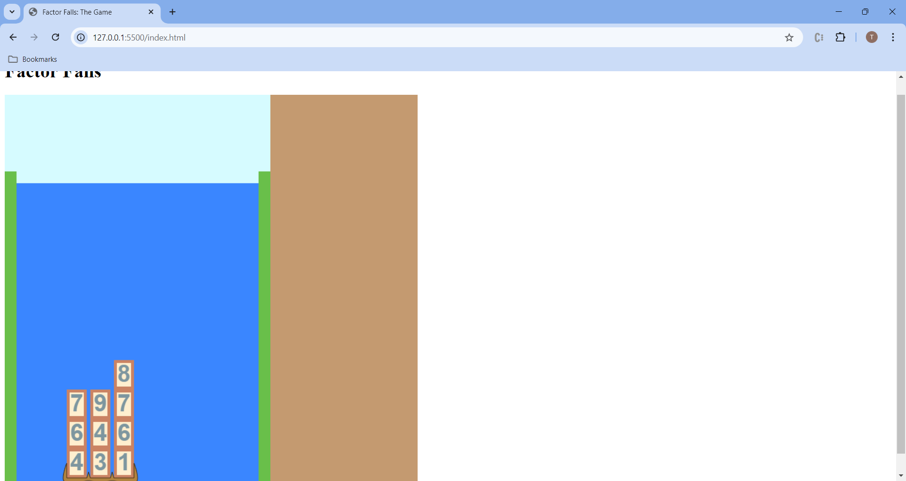
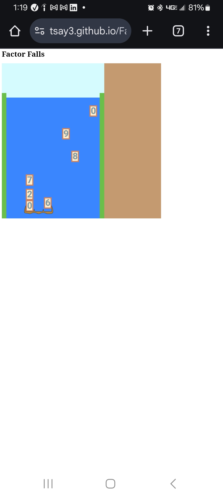

# Day 5: Code Cleanup, Game Refining

## State of the Game

The player is able to move the cartridge and collect blocks, but does not eliminate completed rows, nor interact with falling blocks that have missed the cartridge.

## Today's Goal

Clean up the code and make some modifications to gameplay.

## Background

[Yesterday](4.md), I said I had two choices for what to do today: eliminate blocks, or interact with missed blocks. Upon reviewing the game and its current state, there are a few issues with playing that I think should be addressed:

1. From yesterday's state-of-the-game gif, it is apparent that in its current state, it is barely possible to capture every digit in the cartridge, let alone to make strategic decisions about where those digits should go. Remember that capturing the tiles is not the goal; while we do want to have some tension of racing from one side of the screen to the other, having to make 8 movements from one side to the other is too much to ask. Either we shorten the waterfall, or make the tiles fall slower. And since we want numbers to be formed at a fairly steady rate, narrowing the waterfall is our best action.
2. Similarly, we should affect the spawning locations of the digits so that they are clustered around the middle, making it easier to strategize.
3. Tapping in order to move the cartridge is problematic on mobile devices, due to the built-in "double tap to zoom" feature found in many mobile browsers. We could add some JavaScript or CSS to disable it -- but after playtesting it on mobile, it's clear that the current controls are finicky. A better option: what if merely we directly moved the cartridge to whichever column is selected?
4. There's some inconsistent sizing with our screen. While on desktop, the game barely fits on the entire screen:

On mobile, it's much tinier and harder to see without zooming in:

We'll have to incorporate the window height into our design, and 

5. While we're at it, let's finally add in some keyboard input for the desktop version.

## Actions

Let's start by moving two constants into the constants folder -- the total positions high and wide in the game file. The initial cartridge position is going to be derived from how many positions wide it is -- if there were 3 positions wide, it should be 0; 5, 1; 7, 2; and so forth. A simple floor function after dividing by 2 will do.

Now I try narrowing the waterfall from 10 to 7. The game does act as if it is 7 columns, but it doesn't appear as so, because the numbers are hard-coded into the graphics functions. I will have to distinguish between which 10's are for the total positions wide, and which were for the positions high. Truth be told, there's another element we can adjust here: we want our digits to appear just above the waterfall, so we should have effectively another space above the waterfall. So I also increase the waterfall's height from 10 to 11.

Furthermore, since this is code clean-up, let's separate the three background elements into their own functions.

As I stated in an earlier scene, I rename ``animationX`` and ``animationY`` in the Digit class into ``offsetX`` and ``offsetY``.

There's some trouble with the canvas as a result of our playing with screen constants. Let's think: the two aspects we want to adjust for size will be the side margins and the top margin. Let those two be the variables (along with the total tile width), and we'll adjust them accordingly. We'll also get the screen height and width from the waterfall canvas.

## Issues

## State of the Game, and Future Plans
