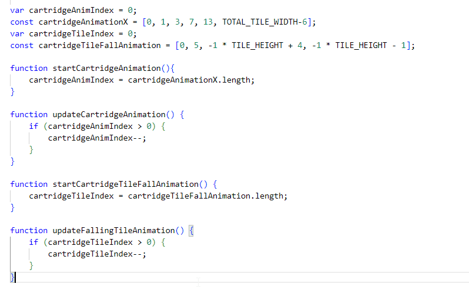
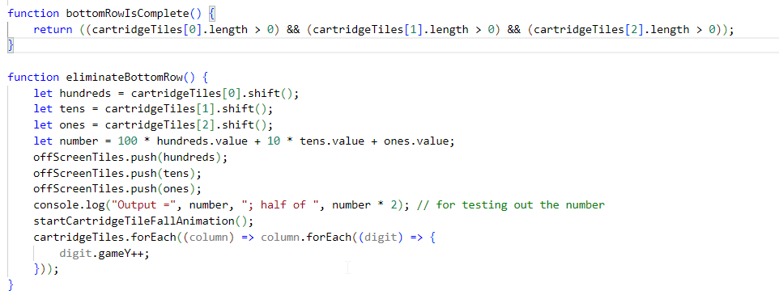
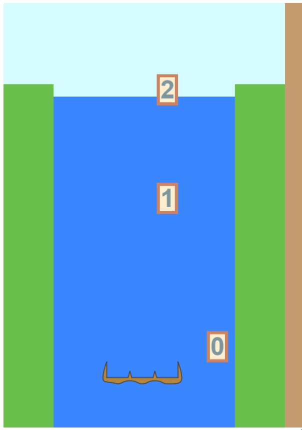

# Day 6: Eliminating Rows

## State of the Game

Last time, I fine-tuned the game to make it more playable and responsive. So now, we have a "game" that is fairly easy to play, consisting of collecting tiles that continuously fall, but with no lose conditions or win conditions.

## Today's Goal

Remove completed rows from the cartridge, and move all cartridge tiles down.

## Background

I say "rows", but in practice, only one row will ever get removed at a time... unless some future design includes digits stacked on top of each other. Even if multiple digits land on the cartridge at the exact same time, the existence of an empty space at the bottom of the cartridge implies every space above it is empty too.

There is one design decision to make: after a row is completed, how fast should the tiles drop down? When do we update the game model to show the blocks have descended? We don't want to introduce a bug where we complete a row and immediately slide to another column with a falling digit to fill in the gap. But we WILL permit the other edge case where we complete a row and immediately move so that a digit lands on the newly fallen blocks. Therefore, the instant a row is completed, all of the blocks on the cartridge should be updated so that they exist on the lower block, and are given a quick 3-frame animation to drop down. 

Note that this animation is the only time a cartridge tile should have its ``offsetY`` info changed -- there's no place for the digits to shift up or down otherwise.

Also note that there's only one place (for now) where row detection happens: when a tile lands on the bottommost row. Note that there will ALWAYS be a space on the bottom that is empty; if they are ever all filled in, that means a row is completed and must be removed.

## Actions

I insert row detection at the place in the code where a tile is added to the cartridge arrays -- the ``updateFallingTile`` function. I introduce a boolean function and a run condition for when that happens.

It also becomes clear that I have two separate cases where I "update" the animation for the cartridge, and for the falling tiles. For consistency's sake, I remove the "updating" from the ``game`` code and move that to the ``drawCartridge`` function in the ``graphics`` file. This consistency also allows me to fix a bug in the cartridge animation where one of the frames was skipped.

So, when a row is completed, we modify the arrays by shifting the first element out -- a negligible time operation for 3 arrays that are at most 11 in length. We send the value out to the console and modify every remaining tile in the cartridge to shift downward. We don't need to assign every tile an animation index; they will all animate together, so we only need to set one value.

## Issues

There was a brief issue where I forgot that it wasn't pure numbers being stored in the array, but Box objects. It was a quick fix to retrieve their values, and move them back into the ``offscreenTiles`` array for recycling.

## State of the Game, and Future Plans

I will be honest, for such an important addition, this was a very simple addition. I only had one hour tonight instead of two, but I'm perfectly happy to end here. The main gameplay loop is finally settling into place. There's just one more feature needed to complete the tile collecting phase: pushing the falling tiles aside!