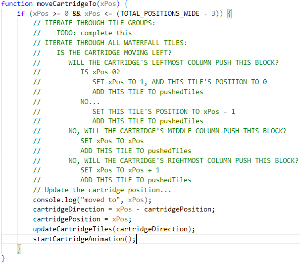
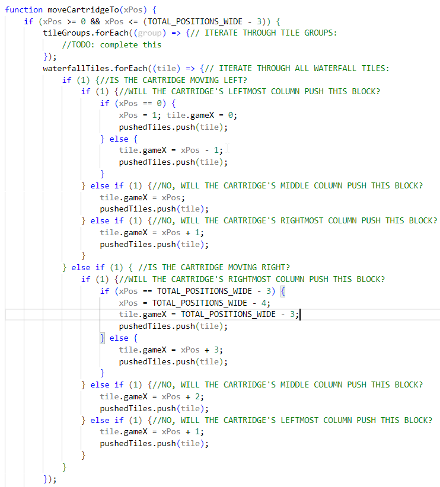
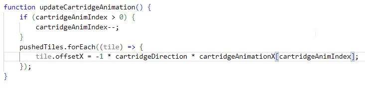
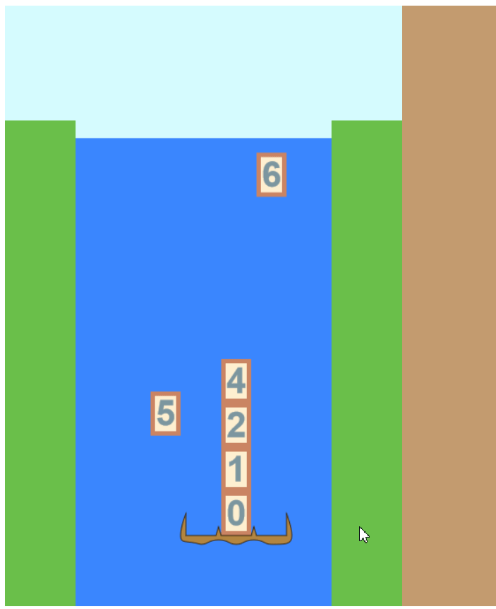

# Day 7: Pushing Blocks, Part 1

## State of the Game

Tiles can be gathered and can disappear, but we still have to deal with tiles that phase through our cartridge.

## Today's Goal

When moving to a new column, push any blocks that would get in a way.

## Background

There's a few options for how the cartridge should interact with falling blocks. The simplest would be to block movement altogether, but that would make for a punishing game, especially with more blocks stacked on the cartridge. The purpose of stacking blocks is so the player can "build" the number they're aiming for; restricting their movement just to catch one block may make catching other blocks more challenging and take away from this strategy. A more intuitive feature would be to push the falling blocks around, "shepherding" them around while trying to catch other falling blocks.

This feature is complicated by the fact that blocks might be side-by-side with each other. This is not a problem right now, since the blocks spawn slow enough for the last one to fall completely out of the way, but it could be an issue when we have multiple-spawning blocks together.

Actually, a simple solution is to group those blocks together when they spawn, and handle them with special logic. This means we only have to worry about single blocks being pushed aside for now...

... but that still leaves the problem of blocks that might be pushed by the left column, the middle column, or the right column.

Let's start with the basics. If the topmost block of a column lies in row CR and column CC, moving to a target column TC, and a falling block is currently in row BR and column BC, then we know that a column will push the block if BR + 1 >= CR. If CC < BC <= TC, then BC is instantly changed to TC + 1, and the block's offset is set equal to the cartridge's. And if CC > BC >= TC, then BC is changed to TC - 1. We execute these checks at the moment that the cartridge changes its target, iterating through all falling blocks (which won't take long, as there will be usually be no more than 5 falling at once), and then through each column.  The cartridge may be blocked if a block is being pushed into column -1 (in a group of blocks, it'll be if the leftmost block is being pushed, but we'll handle that once we get into tile groups.)

## Actions

Okay, so this code is less intuitive than my previous scenarios, so let me break it down into an algorithm (since this is temporary pseudocode, I'll put it in all caps):

I'm thinking in both high-level and low-level implementation details, but one detail I neglected to mention above is a new array variable I've added, ``pushedBlocks``, whose primary attribute is that, after updating the cartridge's offset, every tile there also gets its offset updated.

Now I begin implementing logic (and add in the corresponding half for rightward movement):

Okay, but now there's two problems with it that I can see:

1. What if one tile is checked higher than another tile that will block the cartridge? This former tile will be shoved one column further than the cartridge would push it, because the latter block will update the cartridge's movement without updating the former tile. This shouldn't be a problem, though, since tiles are only added back to ``waterfallTiles`` when they are first spawned.
2. What if the user clicks twice in quick succession, pushing the tiles even further? Each tile will then get added twice to the ``pushedBlocks`` array, creating a double reference that will gradually pollute the code. We can solve this by first checking the array if it's already included (again, very small array here.)

This function is now several lines long (and falls outside the picture here).  Should it be refactored? First, let's see if it works (adding in the ``pushedBlocks`` offset functionality):

## Issues

As I hoped wouldn't be the case, it's very buggy. Tiles are not ending their offset cycles prematurely (and misaligned when they spawn), tiles are getting pulled to the opposite side of a column that's going away from it, and tiles are bypassing the top of a column that pushes onto it.

There is more to fix this code than can be fixed in one day, so I'll stop for now and come back to it later.

## State of the Game, and Future Plans

We've gone from a semi-working if incomplete game to a semi-working and very broken game. We need to think about our current code, but maybe it would help if we created something else to help debug.

There's a feature that I'll need to implement eventually, and now seems as good a time to add it in, since it won't touch our physics code at all, but merely display it. Eventually, we'll need a presentation layer to go over both the game and the satchel, for animating our factors getting added from the game and into the satchel. We can use the presentation layer, instead, as a debugging tool to show what every tile's position as, along with the cartridge's position.

So that's what I'll add, next time.