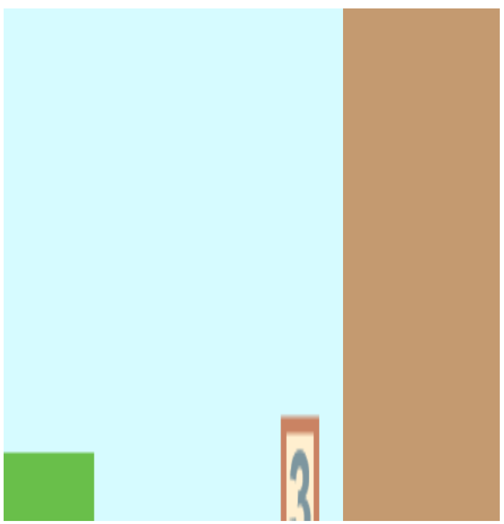
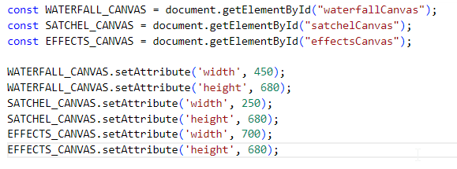
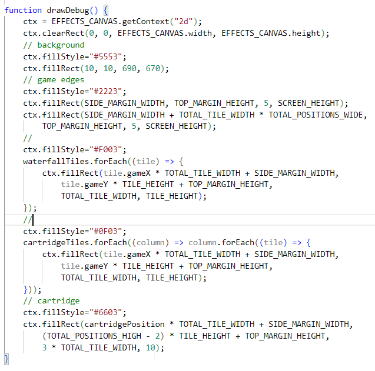
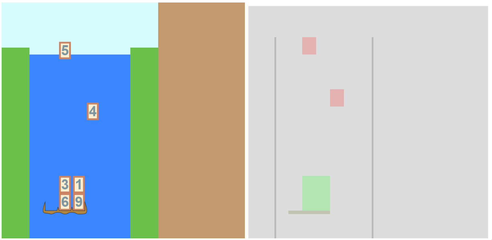

# Day 8: Adding an Effects Layer

## State of the Game

I added the ability for cartridge blocks to push falling blocks, but also made it very buggy -- tiles don't seem to be moving in the right positions.

## Today's Goal

Add an effects layer that will cover both the waterfall canvas and the satchel canvas.

## Background

The effects layer, or as I've called it, the presentation layer, is a planned addition that won't serve any direct gameplay purpose, but serves to make things more interactive with the player. Features that will eventually be added to the presentation layer include:

1. A graphical display of the 3-digit numbers being factored, with those factors then moving towards the satchel;
2. Tutorial boxes that will explain the functionality of the game to a new player;
3. A pause screen to cover both canvases to indicate the game is paused;
4. A game over screen to indicate the player has run out of lives;
5. A welcome screen for when the game first loads.

For now, we want to test this feature with a debugging feature that will help with our pushing block problem: add a transparent overlay that will show what areas are currently occupied by boxes, both falling and cartridge. It will run every frame and take information directly from our ``waterfallTiles`` and ``cartridgeTiles`` arrays.

This feature will require a new canvas added to the HTML file, and it will require some tinkering with CSS as well.

## Actions

Creating a stylesheet and assigning our canvas properties to it is only half the issue. At some point, I'd like to use CSS to assign different values to the canvas's width and height depending on the device or browser size. It turns out that a canvas's ``width`` and ``height`` HTML properties, in addition to setting its width and height on the document, also affects its internal coordinate system. Moving these to CSS causes strange display issues.

This can be solved by setting these attributes within JavaScript. Because of how intertwined the game constants are with the canvas settings, I'll put those settings within my ``constants`` file:

It's not an ideal setup, especially since the width and height are still hard-coded, but it will do for now. Writing the debug screen function is fairly straightforward, thanks to my understanding of the graphical display.

## Issues

More difficult is the task of getting the canvas to lay on top of each other. That will take some research and understanding of CSS display settings. In the meantime, while it may not work as an effects layer, it does serve as a separate view panel to focus solely on the model, rather than on the animation.

## State of the Game, and Future Plans

An effects layer has been added, but it too isn't working properly. Still, by recording a GIF, we're able to get a clearer idea of what's happening. Tomorrow might be a good time to try fixing those block-pushing bugs, using the "debug screen" as an aide (along with adjusting the game constants).
