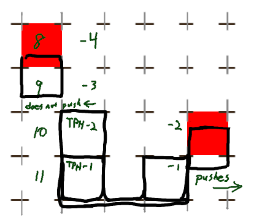
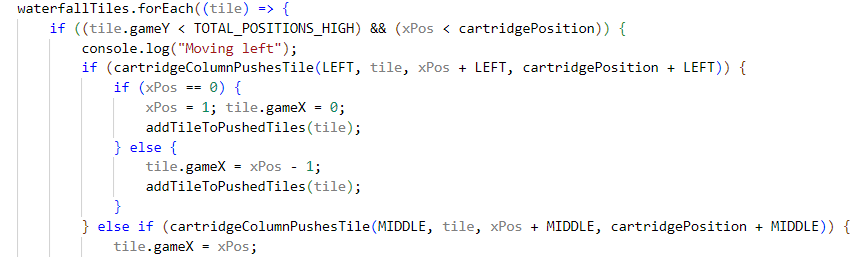
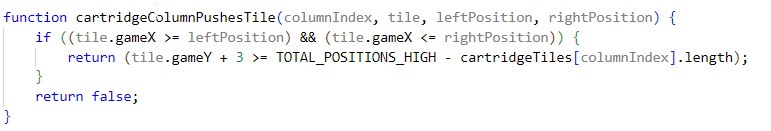
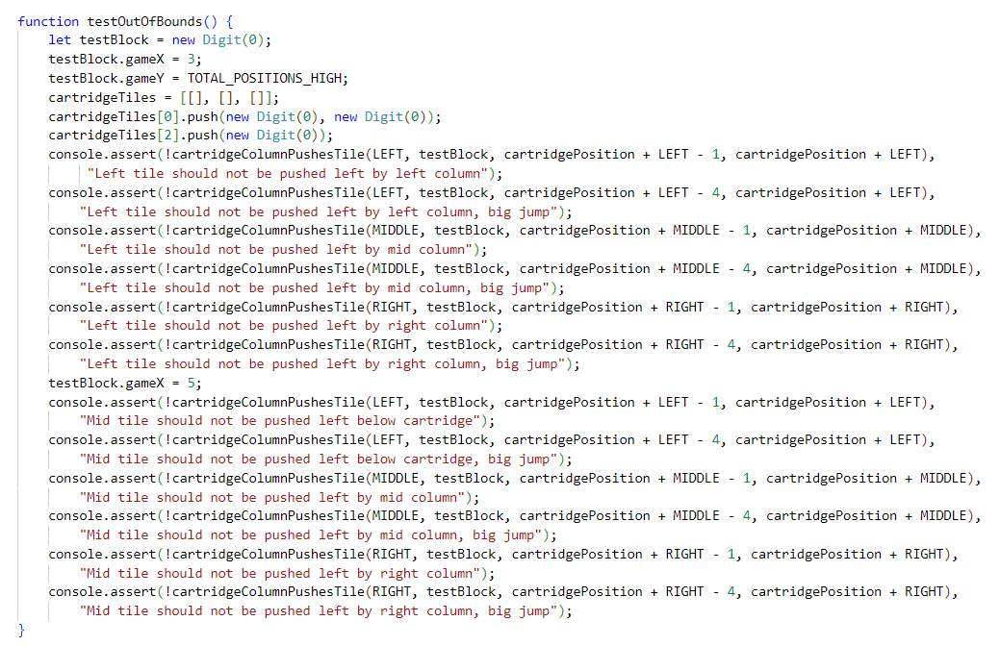
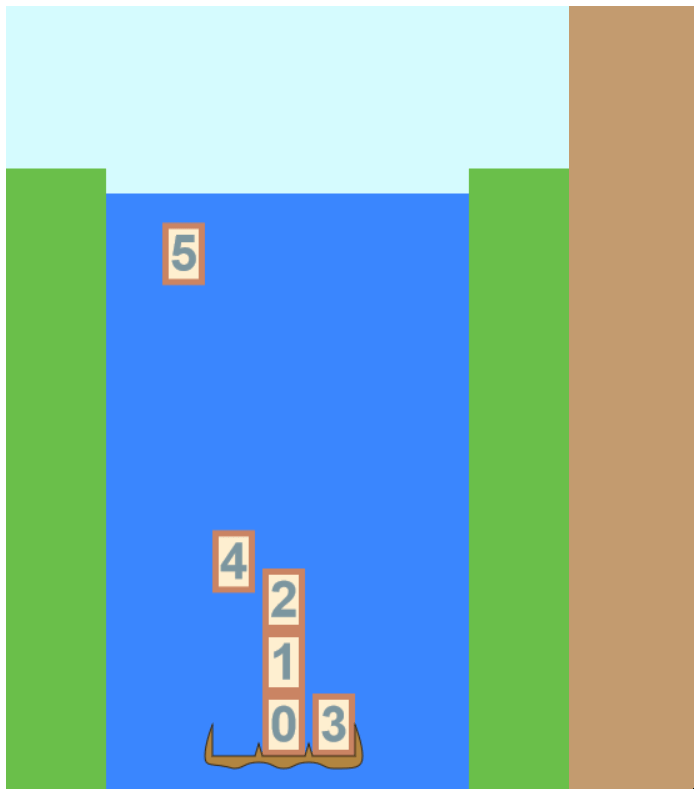

# Day 9: Pushing Blocks, Part 2

## State of the Game

The same as on day 7, but with a debug screen added to see the game model.

## Today's Goal

To fix the block pushing bugs we see earlier, so that I can make a working demo of the block collecting and pushing..

## Background

Recall that in our model, the 0th row is the topmost row. For a game with 12 total positions, the blocks should land on the 11th row if the empty cartridge is in position. All of this is correctly implemented. But there are several issues that need to be addressed with pushing:

1. The check currently only activates when the block's row is 1 below the column's row, whether the cartridge moves toward or away from the block.
2. The check sometimes happens when the block's row exceeds ``TOTAL_POSITIONS_HIGH``, when it should be considered out-of-play instead.
3. Pushing a tile into a wall often results in that tile switching around the column.

## Actions

To solve these issues, it'll take a bit of unit testing.

First, I note that the blocks are always being pushed two blocks down from where they are supposed to be pushed. There's only three places in the code where the tile's ``gameY`` parameter is checked, and two of those are against the global constant ``TOTAL_POSITIONS_HIGH``. The other check compares the column's height with the tile's, as I've marked on my illustration from two days ago:

So since the current test adds 1, but is two blocks further down than intended, I subtract 2 and try it out. No... now it's checking four down instead. So instead I add 2. And now, for whatever reason it works. Sometimes there is no reasoning your way through the game's logic; you simply have to follow the individual testing and go with where the testing goes.

Next, to handle the case of blocks getting pushed and reassigned whether or not they're being pushed or "pulled". On closer inspection, there's a reason for that. My test to see if a block is "pushable" by one column doesn't account for whether that column is going towards or away from the block. So I add in a third parameter to account for if the column is directly left or right of the block, depending on the movement.

Now, this works for one-column movement, but what about several columns? Well, if the idea is to make the function modular, then all of the information should be included in our function call. So let's call the function with the full range of columns that would push the block aside, and use the ``LEFT``, ``MIDDLE``, and ``RIGHT`` constants to make it more readable and consistent.

Another run of the game reveals that there are still other bugs in play, particularly when pushing the blocks into the sides, or dealing with blocks that are below the cartridge. And though it works when the columns are moving left, there are some cases where the column doesn't push a tile right, but instead phases through it.

It's at THIS POINT where I realize that I won't be able to debug the game in time for my demo. Rather than rush together some sloppy code to fake my way through a demo, I'll instead focus on a different, more important task:

# Day 9: Building a Test Suite

## Goal

To create a suite of test cases for testing out the block pushing functions.

## Background

Testing out the block pushing scenarios requires a multitude of test cases. A column has to push blocks that are just above the top, level with the top, and level with the bottom, but it has to ignore blocks that are two rows above the top or are just below the bottom. Each column has to be tested for each of these cases, for either direction, for a multitude of distances. And afterward, each block has to be moved to a correct position. Running the game may give a good feeling that ''something'' is wrong, but it's too much to figure out what is wrong from haphazardly running cases in-game.

What I need is a test suite to handle them every scenario -- a controlled environ. Rather than build it into the game, I'll have a separate HTML file that will run these tests. This can be accessed via [this URL](https://tsay3.github.io/FactorFalls/test.html).

## Actions

First I have to build the testing environment. In fact, that's all I really have time to do today is to get an environment started, with one function block to test out.

I only need to test the ``game`` file, but that relies on other functions in the graphics to work. We don't NEED to update a game cycle, but it's incorporated into the original ``game`` file. The solution is to assign the result of ``requestAnimationFrame(update)`` to a variable ``initialUpdate``, and then within our test code, call ``cancelAnimationFrame(initialUpdate)``.

Of course, we also need to use the ``box`` and ``constants`` files, except ``constants.js`` connects to the canvas elements on our original page. The simplest option is to include those canvas elements in our ``test.html`` file, but set their ``display`` to ``none``.

Okay, so now I can manipulate all of the game variables and create my own scenarios. I'm short on time, so here's a simple example for testing when the tiles are below the cartridge (using ``console.assert`` to run our tests -- I have to use ``!`` before each assertion to ensure that they are false):

Note that even this long test function is complete -- it also has to test for the right edge of the cartridge, and for rightward movement. (In hindsight, I should explicitly set the tile's gameX to be ``cartridgePosition + 1`` to ensure it will be in the middle, and ``cartridgePosition + 3`` to be on its right side.)

## Issues

One last thing to note: some of our test conditionals for blocks are currently inside the ``moveCartridgeTo`` function. I'll have to refactor these tests into the ``cartridgeColumnPushesTile`` function to properly test it. I might also have to move the tile-pushing to its own function as well.

## State of the Game, and Future Plans

Well, our game is able to pass some superficial testing, but our test suite reveals the hidden issues. Next time, I'll expand the the testing suite even further, to cover every possibility. Then I can get to work on those last pesky bugs in the system.